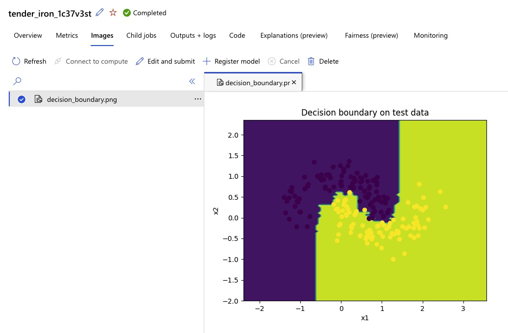
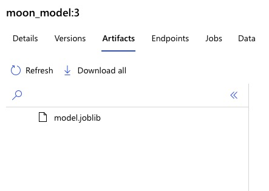

### AzureML Experiment Tracking

1. Training locally
To do this, we will use the `azureml_tutorial/train_original.py` script.
This scripts performs the following steps:
1. Load the data.
2. Preform a grid search to find the best hyperparameters.
3. Evaluate the model on the test data.
4. Log the resulting hyperparameters and metrics.
5. Visualize the resulting decision boundary.
6. Save the model.

Please take some time to read through the code and comments in the `azureml_tracking/train_baseline.py` script.
Make sure that you understand what is happening in each step.
Once you are done, you can run the script using:

```bash
python azureml_tracking/train_baseline.py --train_dataset data/train.csv --test_dataset data/test.csv 
```

After running the script, you should see the following output:
```
Hyper-parameters:
gridsearch/n_estimators [10, 25, 100]
gridsearch/criterion ['gini', 'entropy']
gridsearch/max_depth [2, 5, 10, None]
Selected hyper-parameters:
selected/criterion gini
selected/max_depth None
selected/n_estimators 25
Metrics:
accuracy 0.975
```
Furthermore, you should see a plot of the decision boundary stored in `decision_boundary.png` in your `cwd`.
Finally, you should see a file `model.joblib` in your `cwd`.
See, this [link](https://scikit-learn.org/stable/model_persistence.html) for more details on how sklearn uses joblib to store models.

Now, we know how our training process works. But we cannot keep track of the training processes and models.
We can add experiment tracking to the existing solution such that we can track our experiments in AzureML.

#### 2. Adding experiment tracking
In this section, we will add experiment tracking to the existing solution.
The code will still run locally, but the logs will be collected in the clouds.

The first thing we need to do is tell MLFlow where to store the logs.
We can do this using a MLFlow tracking URI ([docs](https://mlflow.org/docs/latest/python_api/mlflow.html#mlflow.set_tracking_uri)).
AzureML you can get and set the tracking URI by running:
```python
import mlflow
from azureml.core import Workspace

ws = Workspace.from_config()
mlflow.set_tracking_uri(ws.get_mlflow_tracking_uri())
```
So, this will be the first thing we need to do in our training script.

Next, we want to send our hyper-parameters and metrics to AzureML.
We can do this by using the `mlflow.log_param` ([docs](https://mlflow.org/docs/latest/python_api/mlflow.html#mlflow.log_params)) and `mlflow.log_metric` ([docs](https://mlflow.org/docs/latest/python_api/mlflow.html#mlflow.log_metrics)) functions.
Important to note is that mlflow makes a distinction between hyper-parameters and metrics and thus stores them in different places.
By using the `mlflow.log_param` function, we tell mlflow that the value is a hyper-parameter and by using the `mlflow.log_metric` function, we tell mlflow that the value is a metric.
So, in our training script, we need to our print based logging logic with the following:

```python
import mlflow

...
for param, value in param_grid.items():
    mlflow.log_param(f"gridsearch/{param}", str(value))

...
for k, v in grid_search.best_params_.items():
    mlflow.log_param(f"selected/{k}", v)

...

mlflow.log_metric("accuracy", accuracy)
...
```

The last thing we need to do is upload our training artifacts,, like `model.joblib` and `decision_boundary.png`, to AzureML.
We can do this by using the `mlflow.log_artifact` ([docs](https://mlflow.org/docs/latest/python_api/mlflow.html#mlflow.log_artifact)) function.
This function can upload any file on disk.
MLFlow also has the utility function `mlflow.log_figure` ([docs](https://mlflow.org/docs/latest/python_api/mlflow.html#mlflow.log_figure)) that can be used to upload a matplotlib figure directly from memory.
We can use these functions to upload our artifacts to AzureML as follows:

```python
figure = create_decision_boundary_figure(model, df_test)
mlflow.log_figure(figure, "decision_boundary.png")
...
# We use a tmp dir here because we keep the model saved locally.
# However, `log_artifact` needs a path to a file stored on disk.
with tempfile.TemporaryDirectory() as tmp_dir:
    dump(model, f"{tmp_dir}/model.joblib")
    mlflow.log_artifact(f"{tmp_dir}/model.joblib")
```

We have added all these changes to the `azureml_tracking/train_with_mlflow.py` script.
Have a look at the code and make sure you understand what is happening.
When you are done, you can run the script using:

```bash
python azureml_tracking/train_with_mlflow.py --train_dataset data/train.csv --test_dataset data/test.csv 
```

In the AzureML portal, you should now see that your experiment has been queued.
Once the experiment has finished, you should see the following:
- All hyper-parameters and metrics:
  
- The decision boundary should be logged as an artifact:
  
- Your model be registered:
    - 

Now, we have added experiment tracking to the existing solution.
However, we are still running the training process locally.
Now, let's move the training process into the cloud.

### Registering the dataset in AzureML
Before we can run our training process in the cloud, we need to make sure that our data is available in the cloud.
We do this by uploading our dataset to a blob storage and registering it in AzureML.
AzureML already has a default blob storage connected to it.
You can use the Python SDK to upload your data to this blob storage as follows:

```python
from azureml.core import Dataset, Workspace

workspace = Workspace.from_config()
# The default datastore is the blob storage connected to AzureML.
datastore = workspace.get_default_datastore()
Dataset.File.upload_directory("/path/to/local/files", (datastore, 'path/on/the/blob_store'))
```
After this, your data should be available in the blob storage. 
To download the data in a job, we need to remember the path on the blob storage. 
This can be annoying, so we can make it a bit easier by registering the dataset. 
Registering a dataset is just a matter of telling AzureML where the data is stored and giving it a name.
Then in the future, we can just download the data by using `Dataset.get_by_name(workspace, "YOUR_DATASET_NAME").download("path/to/download/location")`.
We can register a dataset as follows:

```python
from azureml.core import Dataset, Workspace
workspace = Workspace.from_config()
datastore = workspace.get_default_datastore()

dataset = Dataset.File.from_files(path=[(datastore, 'path/on/the/blob_store')])
dataset.register(workspace, name="moon_dataset")
```

We have implemented this in the `azureml_scripts/create_dataset.py` script.
Have a look at the code and make sure you understand what is happening.

Sadly, this script does not work on `arm` machines like the M1 Macs.
It only works on `x86_64` machines.
During the creation on the virtual environment, poetry/pip automatically checks if you are on a `x86_64` machine and only install the required packages if your machine is compatable.
So if your machine is not compatible, you will get an `No module named 'azureml.dataprep'` error when you run the script.
If you are using a M1 Mac, it might be easier to use a compute instance.
At least, for this step.

When you are ready, you can run the script using:

```bash
python azureml_scripts/create_dataset.py
```

After you run the script, you should see the dataset in the AzureML portal.
You can find it under `Data` in the left menu.


### Running the code in AzureML
Now that we have access to our data in the cloud, we can run our training process in the cloud.
In this project we use multiple Python libraries, so we need to make sure that all the dependencies are available when we run our code.
In AzureML, we can do this by creating an Environment.
This is a Docker image that contains all the dependencies we need to run our code.
AzureML can build this image for us.
All we need to do is tell AzureML which packages we need using a `requirements.txt` file.
The AzureML SDK has a utility function for this called `Environment.from_pip_requirements` ([docs](https://docs.microsoft.com/en-us/python/api/azureml-core/azureml.core.environment.environment?view=azure-ml-py)), which we can use as follows:

```python
from azureml.core import Environment
env = Environment.from_pip_requirements(
    name="moon_model_env",
    file_path="absolute/path/to/requirements.txt",
)
# Python version must be added in this unclear way
env.python.conda_dependencies.set_python_version("3.8")
```

Another thing we need to do is tell AzureML which code we want to run and on which compute target we want to run it.
We can do this by creating a `ScriptRunConfig` ([docs](https://docs.microsoft.com/en-us/python/api/azureml-core/azureml.core.scriptrunconfig.scriptrunconfig?view=azure-ml-py)).
In this config, we indicate where our Python files are located.
AzureML will copy and upload these files to the compute target and mount them as a volume in the Docker container.
We also need to tell AzureML which bash command we want to run in the container.
We can do this as follows:

```python
from azureml.core import ScriptRunConfig
...
script_run_config = ScriptRunConfig(
    source_directory="absolute/path/to/src",
    command="python main.py", # Bash command to run
    compute_target="name_of_your_compute_cluster", # The name of the compute target can be found in the AzureML under Compute -> Compute clusters
    environment=env, # The environment we created above
)
```

The last thing we need to do is create an experiment and submit the run.
We can do this as follows:

```python
from azureml.core import Experiment
...
experiment = Experiment(workspace=workspace, name="name_of_experiment")
experiment.submit(script_run_config) # The config we created above
```

We have implemented this in the `azureml_scripts/submit_job.py` script. 
Look at the code to see how we combined the above code snippets. 
Once you have an understanding of what is happening, you can run the script using:
```bash
python azureml_scripts/submit_job.py --compute_target <your_compute_target>
```
Make sure that your compute target is up and running.

This script submits a job to the compute cluster that runs the following 3 scripts in sequence:
1. `azureml_tracking/download_dataset.py` This ensures that the data is downloaded from the blob storage.
2. `azureml_tracking/train_with_mlflow.py` This runs the training process, just like we did locally.
3. `azureml_tracking/register_model.py` This registers the model in the AzureML model registry.

### Accessing a registered model
After the training process is done, we can access the registered model in the AzureML model registry.
You download the model from the UI or using the AzureML SDK.

If you want to download the model using the SDK, you can do this by using the `Model` class ([docs](https://docs.microsoft.com/en-us/python/api/azureml-core/azureml.core.model.model?view=azure-ml-py)).
All you need to do is specify the name of the model and the version.
Have a look at the `azureml_scripts/download_model.py` script to see how this is done.
Do you want to try it out yourself?
You can run the script using:

```bash
python azureml_scripts/download_model.py --model <your_model_name>:<your_model_version>
```

### Running the code in AzureML on a custom Docker image
In the previous section, we let AzureML build a Docker image for us. 
This works fine as long as everything is installed using pip or conda. 
Sadly, this is not always the case.
For example, let's say you want to use Poetry to manage your dependencies. 
This is not directly compatible with AzureML.
Luckily, AzureML also allows us to use our own Docker image for scenarios like this. 
So, let's see how we can do this.

The first thing we need to do is create a Docker image.
In this project, we have created a Dockerfile that installs Poetry and all the dependencies.
You can find this Dockerfile in the `Dockerfile` root folder of this repo.

Next, we need to build the image and push it to a Docker registry.
You can do this three ways.
First, you can build it locally and push it to DockerHub.
```bash
docker build --platform=linux/amd64 -t <your_dockerhub_username>/<your_image_name>:<your_image_tag> .
docker push <your_dockerhub_username>/<your_image_name>:<your_image_tag>
```

Secondly, you can build it locally and push it to your private Azure Container Registry.
```bash
az login
az acr login --name <your_acr_name>
docker build -t <your_acr_name>.azurecr.io/<your_image_name>:<your_image_tag> .
docker push <your_acr_name>.azurecr.io/<your_image_name>:<your_image_tag>
```

The third option is to let your Azure Devops CI/CD pipeline build and push the image for you.
You can see an example of this in the `azure-pipelines.yml` file in the root of this repo.

At this point, I assume you have build and pushed your Docker image to a registry.
Now, let's change the job submission script such that it use this custom image.
All we need to do is define a different the `Environment` argument in the `ScriptRunConfig`.
We can do this as follows:

```python
# Create the environment
env = Environment(workspace=workspace, name="custom_image")
# We now provide our own docker image
env.docker.base_image = "YOUR_DOCKER_IMAGE"
# Tell AzureML that we will manage the dependencies ourselves.
env.python.user_managed_dependencies = True
```

Another thing we need to do is change the bash command for the job since we want to use Poetry. 
You can see the complete code in the `azureml_scripts/submit_job_custom_docker_image.py` script.
Look at the code and ensure you understand what is happening.
When you are done, you can run the script using the following:

```bash
python azureml_scripts/submit_job_custom_docker_image.py --docker_image <your_docker_image> --compute_target <your_compute_target>
```

### Conclusion
In this tutorial, we have seen how you can use AzureML as an experiment tracking tool.
The big advantage of AzureML is that it is fully compatible with the MLflow API, which makes getting started easier, especially if you already know MLFlow.
An additional advantage is that you can test your experiment tracking code locally using PyTest-based integration tests since you can also start a local MLFlow server.

This tutorial also explored how we can run our code on a compute cluster in the cloud. Here, you have two options. Either use one of the pre-built Docker images or build a custom docker image.
At this point, you should have a good understanding of how you can use AzureML for experiment tracking. Now, it is up to you to start experimenting with AzureML.

